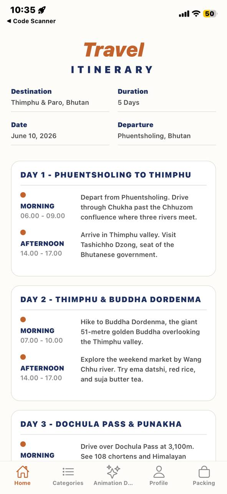
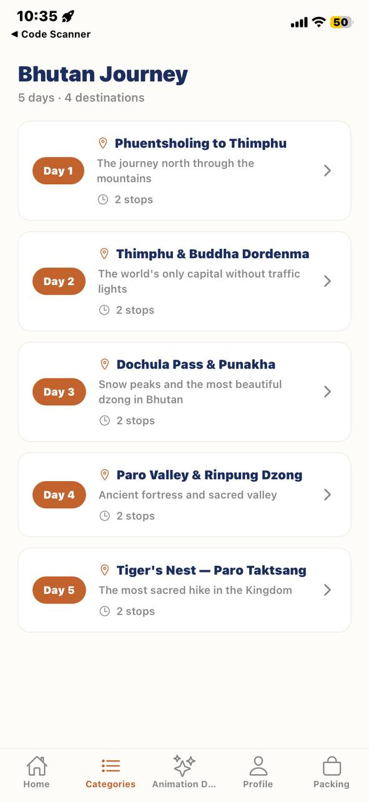
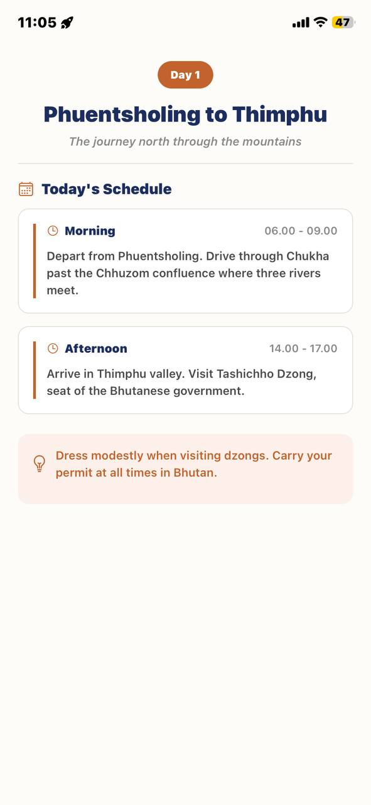
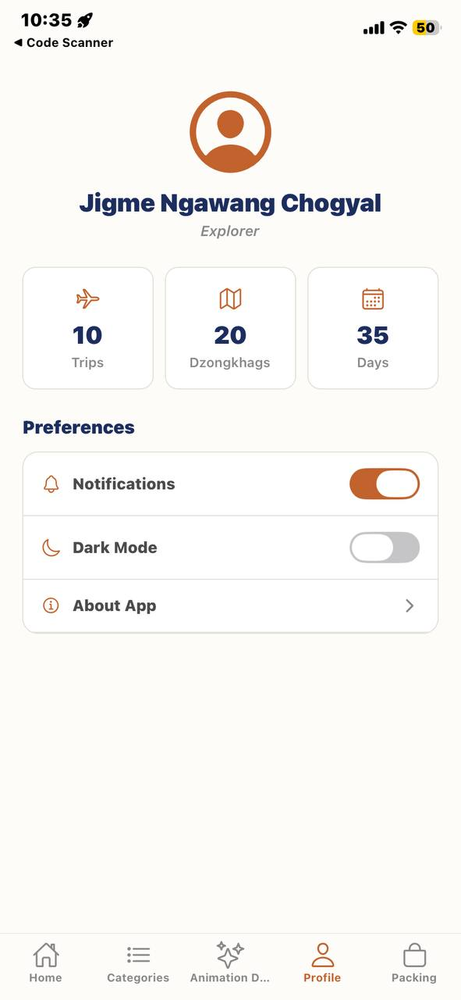
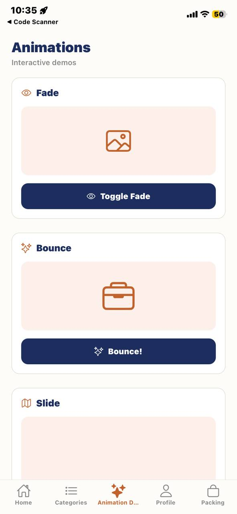
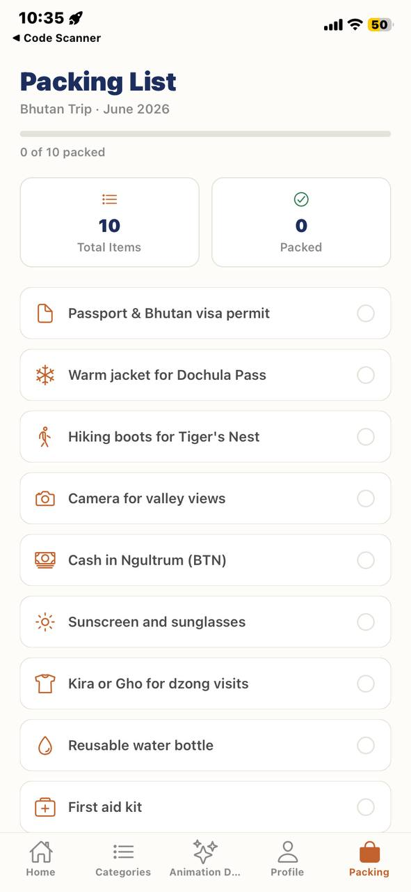

# SWE_201_A1

# Assignment 2 Report

## App Idea

This project is a mobile travel app built with React Native. It presents a polished, multi-screen user flow that helps a traveler view the trip itinerary, browse trip categories, inspect day details, review profile/settings information, and manage a packing checklist.

## Main Features

- Home screen with a trip overview and itinerary cards.
- Category or menu screen for navigating to trip days.
- Detail screen with full schedule information for each day.
- Profile or settings screen with user-style preferences.
- Animation demo screen showing interactive UI animation examples.
- Packing checklist screen with swipe-to-delete and tap-to-check interactions.

## Navigation Flow

The app uses React Navigation with two levels of navigation:

- A stack navigator wraps the main app flow and the detail screen.
- A bottom tab navigator provides quick access to the main screens.

Flow summary:
Home -> Categories -> Detail
Home -> Animation Demo
Home -> Profile
Home -> Packing Checklist

## Animations and Gestures

The app demonstrates multiple animation and interaction techniques:

- Fade-in animation on headers and content blocks.
- Slide animation in the animation demo screen.
- Bounce or scale animation for interactive UI elements.
- Animated progress indicator in the packing checklist.
- Swipe-left gesture to delete a packing item.
- Tap interaction to check and uncheck packing items.
- Spring animation for the success card when the checklist is complete.

## Reusable Components

The codebase uses reusable components to keep the app organized and readable, including cards, list items, and repeated layout sections.

## Screenshots To Submit
- Home Screen
  

- Category
  

- Detail Screen
  

- Profile
  

- Animation Demo Screen
  

- Packing Checklist Screen
  

## Conclusion

This app meets the goal of a clean multi-screen mobile experience with smooth animations, gesture interactions, and practical UI flow.
